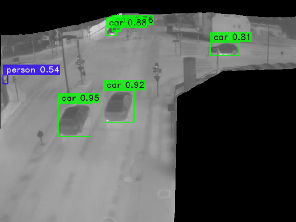
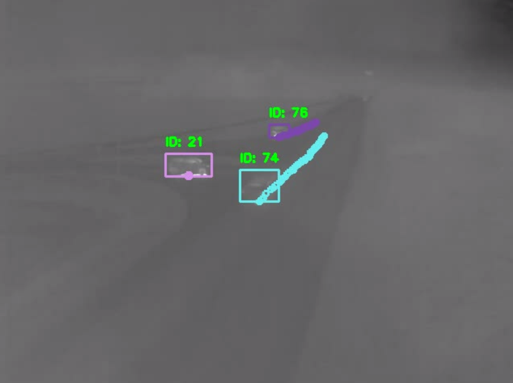
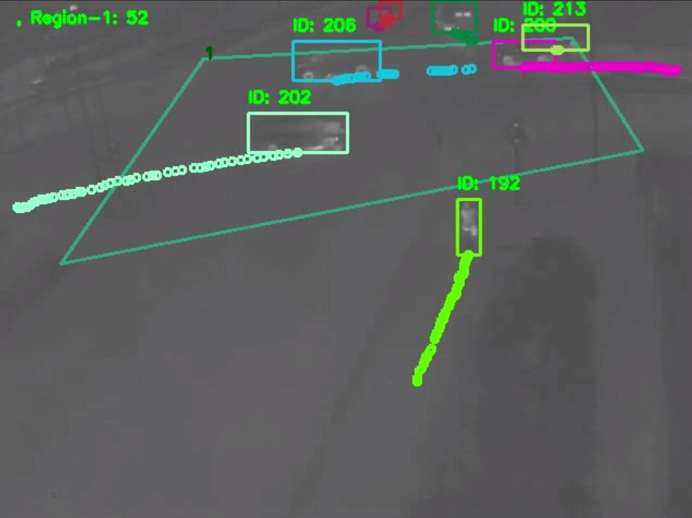
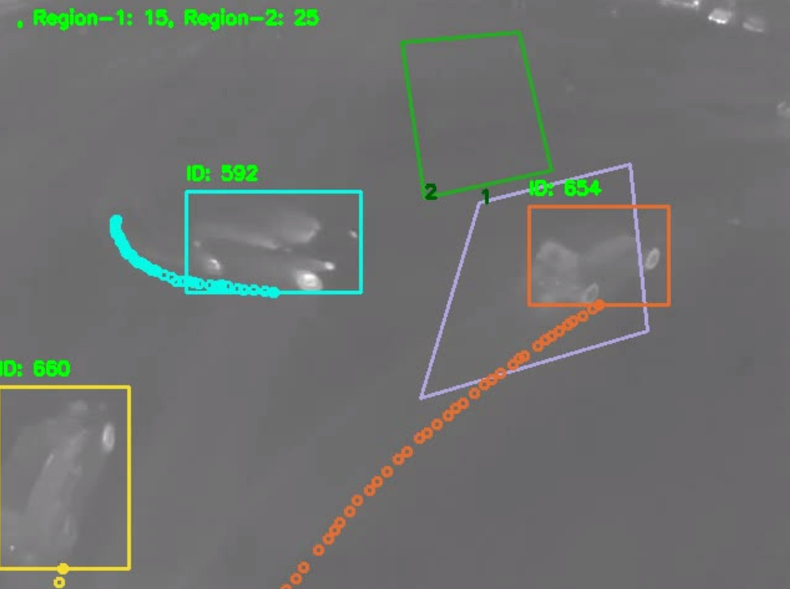
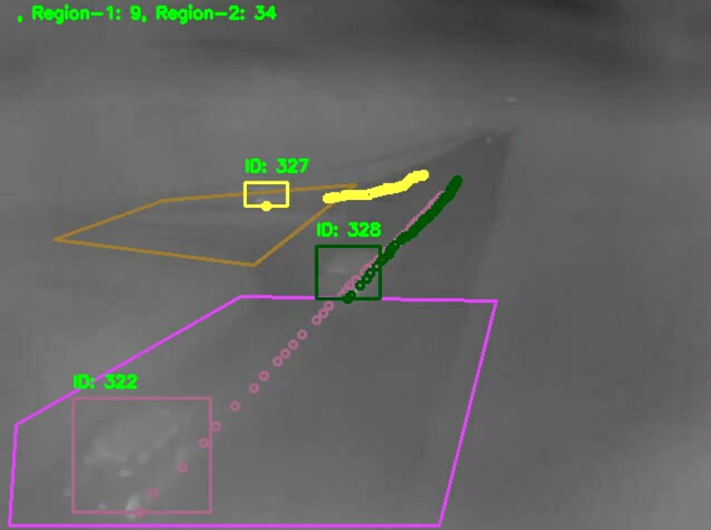

# Traffic Flow Monitoring with Thermal Camera: Vehicle Detection, Tracking, and Counting

  
  

  
  

## Project Description
This project aims to detect various types of vehicles using thermal cameras installed as surveillance sensors in streets. It employs a tracking-by-detection scheme to track the detected objects and subsequently counts the number of unique objects passing through each user-defined polygon.

### Object Detection
For object detection, we utilized `YOLO-NAS` fine-tuned on the `aauRainSnow` dataset ([[Download Link](https://www.kaggle.com/datasets/aalborguniversity/aau-rainsnow)][[License Link](https://creativecommons.org/licenses/by/4.0/)]). Codes for generating the appropriate YOLO annotations from the dataset and training the object detector are included. Additionally, the trained weights are also provided.

### Multi-Object Tracking
For multi-object tracking, we utilize `SORT` (Simple, Online, and Real-time Tracking of multiple objects), which has demonstrated promising results in this task.

## How to Use

### Requirements
For working with images and videos install:
[OpenCV](https://pypi.org/project/opencv-python/)
For using and training object detector install these two packages:
[PyTorch](https://pytorch.org/get-started/locally/)
[Super Gradients](https://pypi.org/project/super-gradients/)
For tracking install:
[SORT Python](https://github.com/MrGolden1/sort-python)

### Training/Fine-tuning the object detector
The link to download trained model weights is located in `checkpoint-object-detection/checkpoint_link.txt`. However, if you want to train it yourself or train with a new set of hyperparameters, follow these instructions:
1. Download the original `aauRainSnow` dataset by referring to the instructions in `dataset/data-link.txt`.
2. Execute `convert_coco_to_yolov7_annotation.py` to create the appropriate YOLO annotation format from the original dataset.
3. Finally, run the code in `finetuning_YOLO_NAS_thermal_camera.ipynb` to train the object detector.

### Configuration files and inputs videos
For tracking and unique object counting in specific regions, you can use the provided configuration file named `config_files`. Configuration files such as `config-co-*.json` are designed for both tracking and counting tasks, while files like `config-tr-*.json` are solely for tracking and do not involve counting.

Place input videos corresponding to the configuration files in the `inputs` folder, following the instructions outlined in `inputs/input-data.txt`.

Feel free to create similar configuration files with different hyperparameters for object detection, tracking, input videos, and regions of interest to customize the counting of unique objects that pass through them.

### Executing the Code
1. Put the path of the configuration file that you want to use in `config_file_path.json`.

2. Run the code with `python run.py`.

## Demo
[![Watch the demo]](readme-files/demo.webm)

